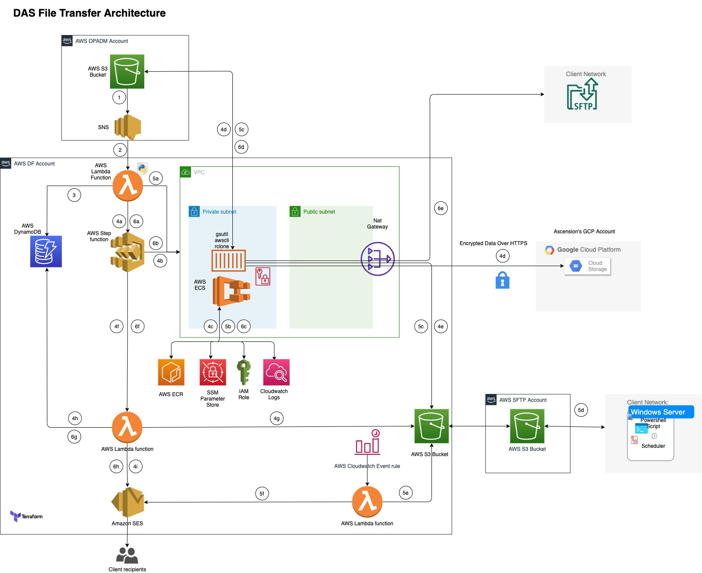
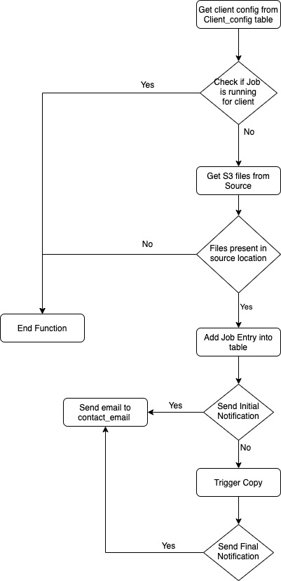
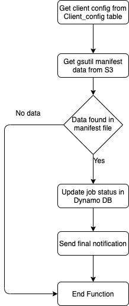

# opadm_file_mover

## Purpose
Terraform layer for OPADM File Mover process. This repository will be designed to support multiple environments:
- `nonprod-shared` - Contains account-level infrastructure for NonProduction/Non-PHI account (575066535343). It instantiates the [persistent](modules/peristent/README.md) module, which includes opadm-filemover account-level resources such as ECS Cluster, ECR and DynamoDB tables.
- `dev` - contains a [logical environment](modules/base/README.md) that sits on top of the infrastructure created by nonprod-shared environment. This can contain isolated infrastructure for development purposes.

## Architecture



Below are the steps for the OPADM File Mover process:

1. Files will be uploaded into S3 bucket of OPADM Account for each client.
2. Once all the files are uploaded an SNS will be triggered which will invoke the Prevalidation Lambda in Datafactory account.
3. Lambda will fetch the Client config and Job tables in DynamoDB table.
4. Ascension file transfer
    1. Lambda invokes the Step function for Ascension client.
    2. Step function will invoke the ECS Fargate task in Private subnet.
    3. Fargate task will fetch the image from ECR and credentials from SSM Parameter Store.
    4. Fargate task performs the file copy from OPADM account S3 bucket to Ascension Google Cloud Storage.
    5. Fargate task will copy the gsutil manifest file into DF account S3 bucket.
    6. Step function will invoke the Post validation Lambda for Ascension.
    7. Lambda will fetch the gsutil manifest file from S3 bucket.
    8. Lambda will update the job status in DynamoDB table.
    9. Final notification will sent to the configured recipients.
5. S3 transfer (Client Pickup)
    1. Lambda invokes the ECS Fargate task in Private subnet.
    2. Fargate task will fetch the image from ECR and credentials from SSM Parameter Store.
    3. Fargate task performs the file copy from OPADM account S3 bucket to DF account S3 bucket.
    4. Replication/process will transfer the files from DF AWS account to AWS SFTP account. Clients will pull the files through SFTP and uploads back log file.
    5. Lambda will be run on a scheduled basis to check for the log file in configured location.
    6. Once the log file is found Lambda will send the log file to the configured recipients.
6. SFTP transfer (Client Delivery)
    1. Lambda invokes the Step function for SFTP client.
    2. Step function will invoke the ECS Fargate task in Private subnet.
    3. Fargate task will fetch the image from ECR and credentials from SSM Parameter Store.
    4. Fargate task performs the file copy from OPADM account S3 bucket to Client SFTP using Rclone tool.
    5. Step function will invoke the Post validation Lambda for client.
    6. Lambda will update the job status in DynamoDB table.
    7. Final notification will sent to the configured recipients.

### Pre-validation Logic



Below are the set of pre-validation logic that will be performed in the lambda.

1) Get the config of the specific client from the client config table.
2) Check if any job is already running for the client by querying the Client Job table. If any jobs are already running then stop the execution.
3) Fetch the list of files from the source location. If the source is empty, skip the execution.
4) Add Job entry into the table.
5) If email notification has to be triggered, get the list of recipients and send out an initial notification.
6) Invoke the Step function or ECS Task based on the destination.

### Ascension post validation Logic



Below are the set of post-validation logic that will be performed in the lambda for Ascension.

1) Get the config of the specific client from the client config table.
2) Get gsutil manifest log file from the S3 location.
3) If data is not found in manifest file, update Job status as Failed and trigger final notification.
4) Update the final job status in Client Job table.
5) Send out the final notification to the configured recipients.

### OPADM post validation Logic

S3 transfer post validation lambda will be run on a scheduled daily basis. Below are the set of post-validation logic that will be performed in the lambda for other clients.

1) Get the config of all the clients from the client config table except Ascension.
2) Check for success/failure log file for all the clients in the configured log location.
3) Based on the success/failure log file configured for each client send out final notification to the configured recipients.

### Resource details

Below are the list of resources that will be created as part of this repo and the name of all these resources will have the same prefix that will be passed as input.

1) S3 bucket 
2) Lambda for prevalidation
3) Lambda for ascension postvalidation
4) Scheduled Lambda for S3 post validation
5) Step Function for Ascension
6) Lambda for SFTP post validation
7) Step function for SFTP transfer
8) ECS Fargate Task
9) Dynamo DB tables for Client config and Job
10) Fargate Outbound Security Group

### DyanmoDB Tables Structure

Below is the structure of the DynamoDB tables and the names are case sensitive.

| TableName | ColumnName | DataType | Sample |
|------|---------|---------|---------|
| {var.project}-client-config | ClientId | String | 'H000166' |
|  | contact_email | String | 'abc@xyz.com' |
|  | destination | Map | Ascension - { "path" : { "S" : "gs://bucketname/foldername/" }, "location" : { "S" : "google" } } S3 Transfer - { "path" : { "S" : "s3://s3bucket/folder/" }, "location" : { "S" : "s3" }, "loglocation": {"S": "s3://575066535343-users/opadm_s3/h333/incoming/log/"} }  SFTP - { "sftpcredentials" : { "S" : "/das/sftp_user" }, "location" : { "S" : "sftp" } }|
|  | send_notification | Boolean | true |
| {var.project}-client-job | ClientId | String | 'H222' |
|  | JobId | String | 004bac9e-8efb-4ed4-9c95-d3d896a1d6c3 |
|  | Jobstatus | String | success/Processing/Failed |
|  | started_at | String | 2021-10-11T10:41:10.776333 |

## Client Configuration

For all the clients below are the mandatory fields that has to be added into the client_config.json file
- clientid - Client ID matching with the clientid from OPADM SNS
- send_notification - If notification(emails) has to be triggered for the copy process
- contact_email - List of email ID for which notification has to be sent
- destination - Destination where the files needs to be transferred. Format will be the following for each transfer
    - Google (Ascension): { "path" : { "S" : "gs://bucketname/foldername/" }, "location" : { "S" : "google" } }
        - Path - Storage path within Google account including the bucketname and foldername
    - S3 Transfer: { "path" : { "S" : "s3://s3bucket/folder/" }, "location" : { "S" : "s3" }, "loglocation": {"S": "s3://575066535343-users/opadm_s3/h333/incoming/log/"} }
        - Path - S3 URL including bucketname and foldername where files needs to be transferred
        - LogLocation - S3 URL including bucketname and foldername where log file for the client will be uploaded from the client
    - SFTP - { "sftpcredentials" : { "S" : "/das/sftp_user" }, "location" : { "S" : "sftp" } }
        - sftpcredentials - SSM Parameter Name containing the client SFTP credentials with hostname

### Production push change

Update Jenkins file for the below variables:
- seekApproval variable to True. 
- deployApprovers with list of MSID of folks who would approve the Jenkins apply.
- EMAIL_RECIPIENT with list of emails who need to be notified for Jenkins build status.

### Client On-boarding

Below config has to be added into the client_config.json file for on-boarding 

- Ascension (google transfer):

```
{
        "send_notification": {
          "BOOL": true
        },
        "clientid": {
          "S": "H000166"
        },
        "destination": {
          "M": {
            "path": {
              "S": "gs://bucket/folder/"
            },
            "location": {
              "S": "google"
            }
          }
        },
        "contact_email": {
          "S": "xyz@abc.com,abc@abc.om"
        }
```

- S3 Transfer (Client Pickup):

```

{
        "send_notification": {
          "BOOL": true
        },
        "clientid": {
          "S": "H0002"
        },
        "destination": {
          "M": {
            "path": {
              "S": "s3://bucket/H0002/"
            },
            "location": {
              "S": "s3"
            },
            "loglocation": {
              "S": "s3://bucket/opadm_s3/H0002/incoming/log/"
            }
          }
        },
        "contact_email": {
          "S": "xyz@abc.com,abc@abc.om"
        }
}

```

- SFTP Transfer (Client Delivery):

```

      {
        "send_notification": {
          "BOOL": true
        },
        "clientid": {
          "S": "H0001"
        },
        "destination": {
          "M": {
            "location": {
              "S": "sftp"
            },
            "sftpcredentials": {
              "S": "das_H0001_sftp"
            }
          }
        },
        "contact_email": {
          "S": "xyz@abc.com,abc@abc.om"
        }
      }

```

**Note**: Modifications to any of the clients config performed will not be reflected in the DynamoDB. So, to update existing client details the config for the specific client has to be removed and pushed into repository. This will remove the client config from DynamoDB table. Once it is removed the proper config of the client has to be added back into the json and pushed into repository which will trigger the Jenkins build to add the client back into the DynamoDB table.

To remove any client from the DynamoDB, remove the config for the client from the client_config.json file and push the changes into the repository. This will trigger the Jenkins build and remove the client from DynamoDB.

## Features
- See [persistent](modules/peristent/README.md) module and [logical environment](modules/logical-environment/README.md)

### Branching Strategy
The main branch is `dev`. Any changes to that branch will automatically be deployed to both the `nonprod-shared` and `dev` environments.

Once code has been tested, it can be promoted to the `prod-shared` branch. A merge to `prod-shared` will automatically execute a terraform plan on the `prod-shared` environment. However, because this has the potential to impact production workloads, in order to proceed with the terraform apply, the Jenkins build must be approved.

From there, code can continue to be promoted to `dev-phi`, `qa`, and `stg` branches. Merges to those branches will auto deploy to the corresponding logical environments with no approval needed in Jenkins. Once created, the `prd` branch and environment are expected to require approvals.

### Build and Test Instructions
All developers should be using terraform **0.14.10** for this repository. Installing `tfswitch` is recommended to switch between terraform versions. Any changes should part of the `persistent` or `base` modules or their submodules. The developer workflow should involve updating one or both of those modules. Developers should be able to test that their terraform code works by:
1. changing their directory to either `environments\nonprod-shared` or `environments\dev` (depending on which they are updating)
2. Authenticate to AWS using the python authentication scripts.
3. `terraform init`
4. `terraform plan`
5. Review output plan to ensure it makes expected changes.
6. Create pull request with desired changes against the `dev` branch. The pull request in Jenkins will also start a terraform plan on both the `nonprod-shared` and `dev` environments.